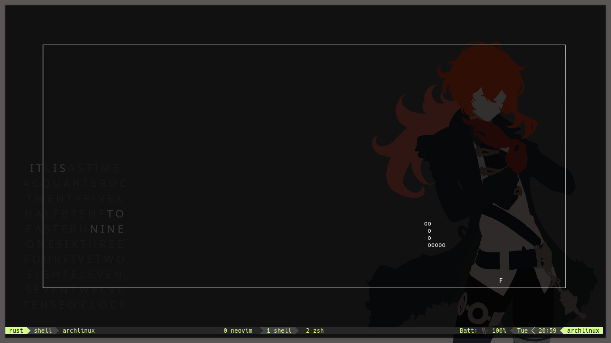

## Snake in rust using [ncurses](https://docs.rs/ncurses) crate

The game is playable

run with

```bash
cargo run
```

#### Keybinds

hjkl or arrow keys for movement

esc or p to pause

#### Screenshot

Click the image for asciinema

[](https://asciinema.org/a/FVB1DZmA7lVK4BILFkzkreMQ9?autoplay=1)

#### Need unicode support in terminal to print the snake

The unicode characters used are:

- 0x0298 ʘ
- 0x2550 ═
- 0x2551 ║
- 0x2554 ╔
- 0x2557 ╗
- 0x255a ╚
- 0x255d ╝

#### Todo :construction:

- [ ] Add a way to change the snake speed
  - [ ] Make a ui to switch the snake speed
  - [x] Interal implementation of the snake speed
- [ ] Implement Highscore System
  - [ ] Make the ui
  - [ ] Internal Implementation
- [x] Use unicode charachters to draw the snake

#### Bugs :bug:

- ~~Snake going through the walls~~
- ~~Food spawning in the walls~~
- ~~Boxdraw characters not rendering properly~~
- Remove all the logging in the ui
- Pausing delayed if esc is pressed but not if p is pressed.
- The game flickers a lot after sometime (probably due to the constant redrawing of the whole board every tick)

#### Maybe in the future

- [ ] Autoplay the game using a simple pathfinding algorithm (to show on [r/unixporn](https://reddit.com/r/unixporn) of course :clown_face:)

#### Notes

A few notes about the game and how I should improve the game

<details>
<summary>A few notes about time complexity and redrawing with ncurses</summary>

> The complexity of the program is O(n) every tick (time which changes relative to the speed)

> However the place, I can improve is the redrawing of the game

> At the time of writing the in commit
> <a href="https://github.com/uttarayan21/snake/commit/de66f7d249a56f883dd632598a4178b1bd1320ba">f9be68e</a>
> the game still redraws the total board and the total snake every tick.

> I think this can be improved by only drawing the parts of the snake and the board when needed

</details>
<br>

<details>

<summary>Rust specific stuff I learned</summary>

> [char](https://doc.rust-lang.org/stable/std/primitive.char.html) and [std::char](https://doc.rust-lang.org/stable/std/char/index.html) are not the same.
> [char](https://doc.rust-lang.org/stable/std/primitive.char.html) is the primitive type [std::char](https://doc.rust-lang.org/stable/std/char/index.html) is the char module.

> As of Sat, 23 Jan 2021 21:49:13 +0000 the char::from_u32 (used in this program) is not valid in primitive [char](https://doc.rust-lang.org/stable/std/primitive.char.html) but is valid in [std::char](https://doc.rust-lang.org/stable/std/char/index.html)

> [ncursesw](httsp://docs.rs/ncursesw) is not needed to print unicode characters. I have no clue where I got that idea from.

</details>
